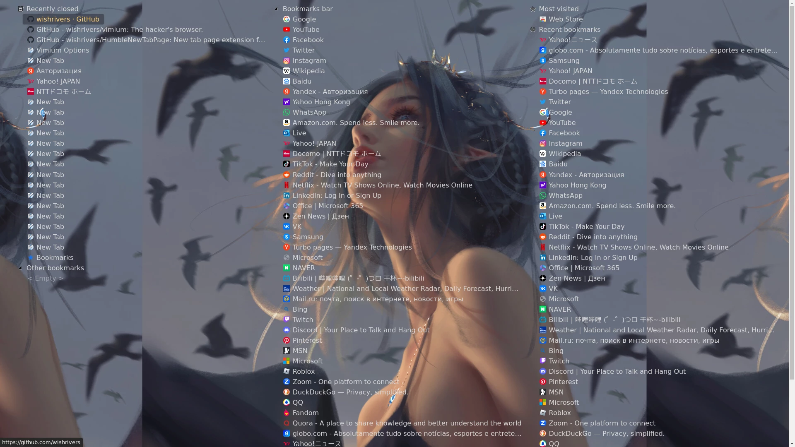
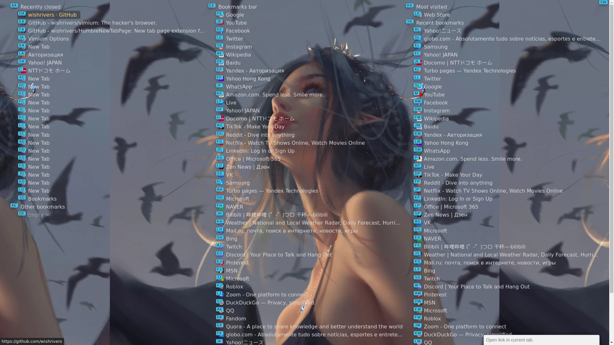
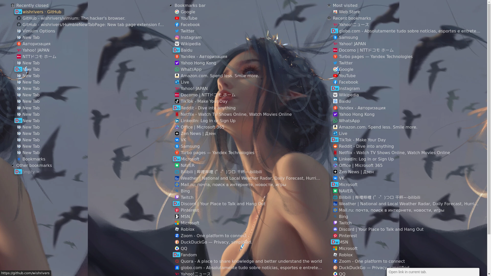
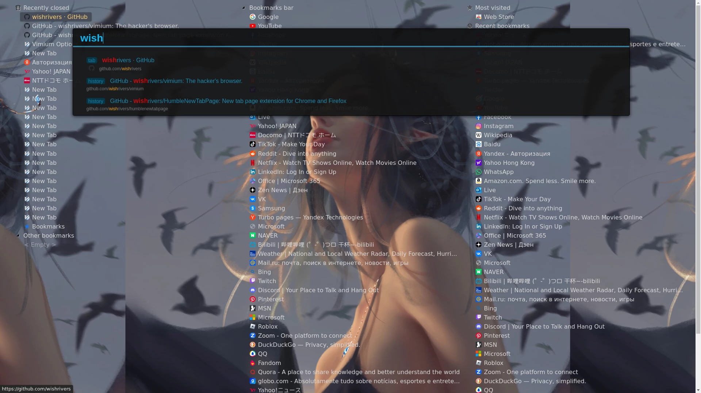
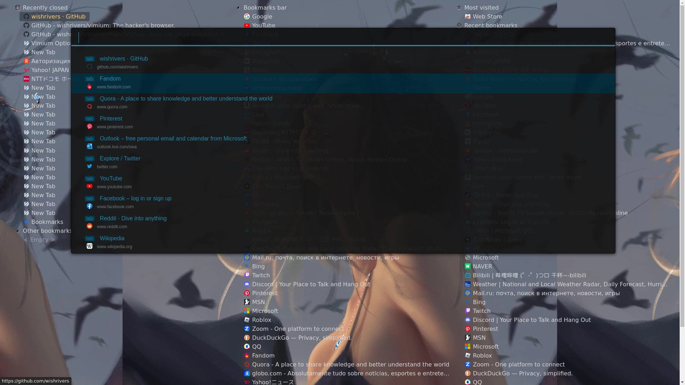
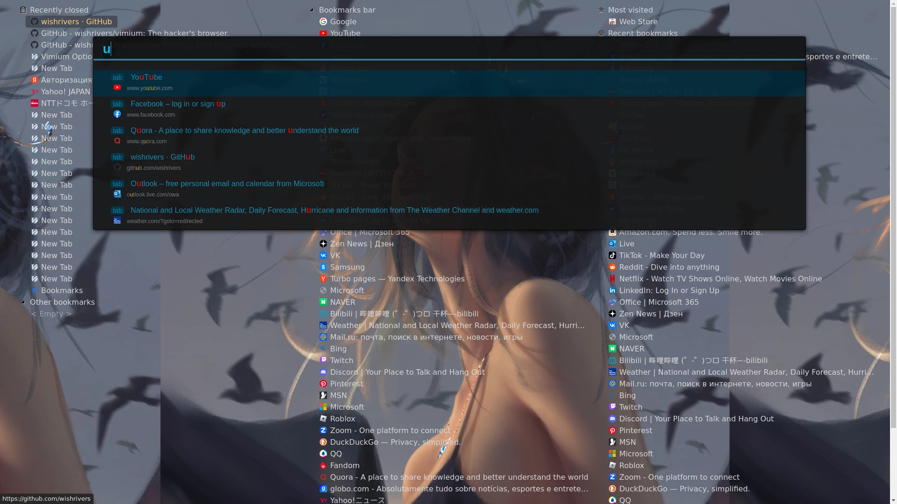
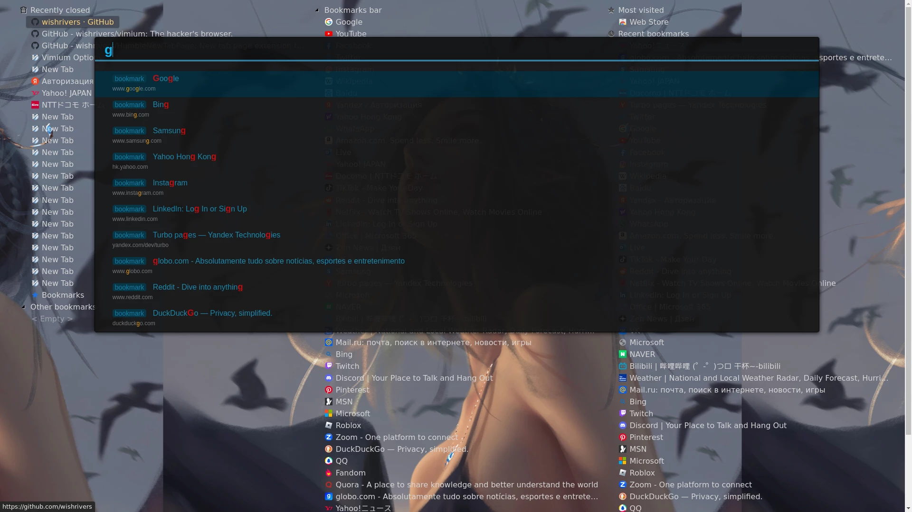

# Vimium Tabpage
[Vimium](https://github.com/philc/vimium) is awesome, [HNTP](https://github.com/ibillingsley/HumbleNewTabPage) is awesome, too.
but vimium cann't run on the HNTP tabpage. so, I merge them, let they works well. Finally, it looks like this:
<!--  -->


## Install

### 1. Git Clone
```bash
git clone https://github.com/wishrivers/VimiumTabpage.git
git submodule init
git submodule update
```

### 2. Chrome Install
1. Open chrome extensions page: `chrome://extensions` OR chrome `menu > More tools > Extensions`
2. Enable `Developer Mode` in the top-right corner.
3. click `Load unpacked`, select the VimiumTabpage dir path: /path/to/VimiumTabpage
4. Disable `Developer mode`


## Config

### Vimium - Link Hint: Sky Blue Style
Vimium > options > Advanced Options > CSS for Vimium UI:
```css
div > .vimiumHintMarker {
    background: #111111 !important;
    border: 1px solid #222222;
    padding: 2px 5px 0px 5px;
}

div > .vimiumHintMarker span {
    color: deepskyblue;
    font-size: 14px;
    font-weight: normal;
    padding-right: 1px;
}

div > .vimiumHintMarker > .matchingCharacter {
    color: red;
    font-size: 25px;
    font-weight: bold;
    padding-right: 2px;
}
```

#### Disable Blue Theme
if you donn't like the Blue Dark Theme, comment or delete these lines:
- VimiumTabpage/vimium/pages/vomnibar.html:
    ```css
    <link rel="stylesheet" type="text/css" href="../vimtab/vomnibar-blue.css" />
    ```
- VimiumTabpage/HumbleNewTabPage/newtab.html:
    ```css
    <link rel="stylesheet" type="text/css" href="../vimium/vimtab/tabpage-linkhint-blue.css" />
    ```

### HumbleNewTabPage: Background Image
`Options > Appearance > Background image - Choose file`
open a new tab, and then click the small `🔧`__wrench icon__ in the _upper-right corner_ of the page to access the Options.


## Usage

### 1. `Ctrl+T` or `t`: New Tabpage


### 2. press `f`: Link hits



### 3. press `o`: Vimium bar


#### press `T`: Tab



#### press `b`: Bookmark

